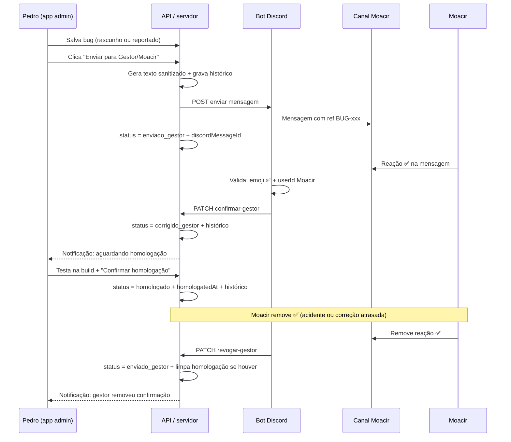
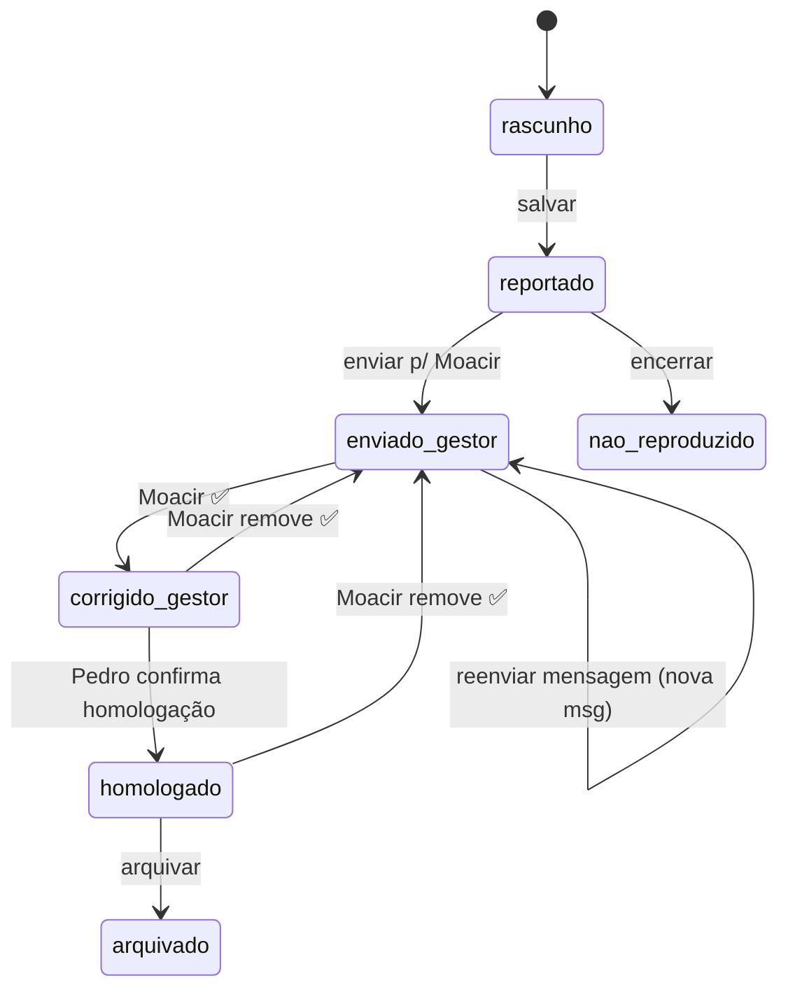

# QA Application — Especificação (rascunho para revisão)

> **Status:** em revisão — não implementar além deste escopo até aprovação.  
> **Pasta no repo:** `qa-app/` — produto **QA Automate**, multi-projeto (`polygonus`, `anihype`).  
> **Dados:** `data/projects/<slug>/bugs.json`

---

## 1. Visão

### 1.1 O que é

Uma **aplicação web interna** para:

1. **Registrar bugs** com formulário estruturado (inspirado no QA Recorder / test-builder do print de referência).
2. **Acompanhar todo o ciclo** na própria aplicação — com aba **Histórico** auditável.
3. **Enviar para o gestor (Moacir)** via Discord — mensagem de texto no canal dele.
4. **Receber confirmação** quando Moacir reagir com ✅ na mensagem → status atualiza na aplicação.
5. **Duas visibilidades:** admin (Pedro, tudo) e visitante (recrutador, portfólio curado).

### 1.2 Princípio central

> **Tudo que acontece deve constar na aplicação.**  
> Discord é canal de comunicação; a aplicação é a **fonte da verdade** e o registro completo.

### 1.3 Não-objetivos

- Substituir Linear ou Sentry (complementam)
- Cadastro de usuários / multi-tenant
- Expor dados sensíveis ao visitante ou ao Discord
- Webhook sozinho como integração bidirecional (insuficiente — ver §6)

---

## 2. Personas e papéis

| Papel | Quem | Onde age | O que vê |
|-------|------|----------|----------|
| **admin** | Pedro (QA) | Aplicação | Tudo: rascunhos, envios, histórico, links internos |
| **visitante** | Recrutadores (login compartilhado) | Aplicação | Destaques `showInPortfolio`, processo de QA, sem PII |
| **gestor** | Moacir | **Discord apenas** | Mensagem formatada; confirma com ✅ — não precisa abrir a aplicação |

Moacir **não** tem login na aplicação na v1. O fluxo dele é 100% Discord.

---

## 3. Fluxo principal — Registrar → Enviar → Confirmar



### 3.1 Estados do bug (máquina de estados)

| Status | Significado | Quem move |
|--------|-------------|-----------|
| `rascunho` | Formulário em preenchimento | Pedro |
| `reportado` | Salvo na aplicação, ainda não enviado ao gestor | Pedro |
| `enviado_gestor` | Mensagem no Discord; aguardando ✅ do Moacir | Sistema (envio) |
| `corrigido_gestor` | Moacir reagiu ✅ — declara que corrigiu | Moacir (Discord) |
| `homologado` | Pedro testou e **confirmou** que está corrigido | Pedro (app) |
| `nao_reproduzido` | Encerrado sem reprodução | Pedro |
| `arquivado` | Fora do fluxo ativo | Pedro |

**Ciclo feliz:**

```
reportado → enviado_gestor → corrigido_gestor → homologado
```

**Regra de ouro:** `homologado` **só** via botão manual do Pedro na aplicação — nunca automático pelo ✅ do Moacir.

### 3.2 Transições — diagrama



### 3.3 Botão "Enviar para Gestor/Moacir"

**Pré-condições:**

- Bug com `title`, `project`, `platform` preenchidos
- Status `reportado` ou reenvio permitido de `enviado_gestor` (com confirmação)

**Ação:**

1. Monta mensagem de texto (template §6.3) — **sem PII, sem URL Carmotere, sem credenciais**
2. Bot publica no canal configurado (`DISCORD_MOACIR_CHANNEL_ID`)
3. Grava em `discord.messageId`, `discord.channelId`, `discord.sentAt`
4. Atualiza status → `enviado_gestor`
5. Append em `history[]`

**Reenvio:** nova mensagem no Discord + entrada no histórico. Se status era `corrigido_gestor` ou `homologado`, tratar como novo ciclo — preferir exigir que gestor tenha estado alinhado (remover ✅ antes) ou forçar status → `enviado_gestor` ao reenviar.

### 3.4 Reação ✅ do Moacir (adicionar)

**Requisitos técnicos:**

- **Bot Discord** com intent `GUILD_MESSAGE_REACTIONS`
- Whitelist `DISCORD_MOACIR_USER_ID` — só essa conta altera status via reação
- Emoji aceito: `✅` (`white_check_mark`) — configurável em env

**Ao detectar ✅ adicionado** (status atual = `enviado_gestor`):

1. Localiza bug por `discord.messageId`
2. Status → `corrigido_gestor`
3. `discord.confirmedAt` = timestamp da reação
4. `discord.confirmedByUserId` = id do Moacir
5. Histórico: `{ actor: "moacir", action: "confirmed_fix", via: "discord_reaction" }`
6. Notifica Pedro: *"Moacir confirmou correção — aguardando sua homologação"*

**Ignorar ✅ se:** status não for `enviado_gestor` (ex.: já `homologado` sem ter passado por novo envio) — registrar em log, não alterar.

### 3.5 Reação ✅ removida pelo Moacir

Cenários reais: clique acidental, ou gestor **volta atrás** porque a correção atrasou / precisa de outra mudança.

**Ao detectar ✅ removido** por `DISCORD_MOACIR_USER_ID`:

| Status antes | Status depois | Efeitos colaterais |
|--------------|---------------|-------------------|
| `corrigido_gestor` | `enviado_gestor` | Limpa `discord.confirmedAt`; mantém `messageId` |
| `homologado` | `enviado_gestor` | Limpa `homologatedAt`; homologação **revogada** |
| `enviado_gestor` | (sem mudança) | Só histórico, se aplicável |

**Sempre:**

1. Histórico: `{ actor: "moacir", action: "revoked_fix", via: "discord_reaction_removed", detail: "Gestor removeu confirmação" }`
2. Notifica Pedro: *"Moacir removeu ✅ em BUG-xxx — homologação pendente novamente"*
3. UI exibe banner no bug: **"Confirmação do gestor revogada"**

**Regra:** remoção do ✅ **nunca** apaga o envio original — a mensagem no Discord continua; Moacir pode reagir ✅ de novo quando estiver pronto.

**Reação de outro usuário:** ignorada (não altera status).

### 3.6 Homologação manual (Pedro)

**Botão:** `Confirmar homologação` — visível **somente** quando `status === corrigido_gestor`.

**Pré-condição:** Pedro testou na build e reproduziu o fluxo de validação.

**Ação:**

1. Status → `homologado`
2. `homologatedAt` = agora
3. Histórico: `{ actor: "pedro", action: "homologated", detail: "Homologação manual confirmada" }`
4. (Opcional fase 2) Webhook Discord: *"Bug BUG-xxx homologado por QA"*

**Não existe** homologação automática ao receber ✅ do Moacir.

**Após homologar:** se Moacir remover ✅, volta para `enviado_gestor` (§3.5) — Pedro precisa homologar de novo após novo ✅.

### 3.7 Campos Discord no modelo

```typescript
discord?: {
  channelId?: string;
  messageId?: string;           // vincula reações à mensagem certa
  sentAt?: string;
  confirmedAt?: string | null;  // null após revoked_fix
  confirmedByUserId?: string;
  lastReactionAt?: string;      // add ou remove — auditoria
};
```

---

## 4. Interface da aplicação (admin)

Inspirada no print QA Recorder (`/test-builder`), adaptada para **bugs**.

### 4.1 Layout

```
┌─────────────┬──────────────────────────────────┬─────────────────┐
│  Sidebar    │  Conteúdo principal              │  Propriedades   │
│             │                                  │                 │
│  • Bugs     │  [Título do bug]     ID: BUG-…   │  Projeto        │
│  • Destaques│  ─────────────────────────────   │  Plataforma     │
│  • Processo │  Detalhes | Comentários | Hist.  │  Status         │
│  (visitante)│                                  │  Prioridade     │
│             │  [Formulário / tabela / hist.]   │  Build          │
│             │                                  │  Módulo         │
│             │  [Salvar] [Enviar p/ Moacir]     │  showInPortfolio│
│             │  [Confirmar homologação]*        │                 │
└─────────────┴──────────────────────────────────┴─────────────────┘
```

\* Botão **Confirmar homologação** só quando status = `corrigido_gestor`. Banner de alerta quando gestor revogou ✅.

### 4.2 Lista de bugs (home admin)

- Tabela com filtros: projeto, status, plataforma, busca
- Contadores: total, aguardando gestor, **aguardando homologação** (`corrigido_gestor`), homologados, **confirmação revogada** (voltou a `enviado_gestor` após `revoked_fix`)
- Clique na linha → abre **detalhe / editor**

### 4.3 Formulário de registro (detalhe)

**Aba Detalhes** (como no print):

| Campo | Tipo | Obrigatório |
|-------|------|-------------|
| Título | texto | sim |
| Descrição / objetivo | textarea | sim |
| Pré-condições | textarea | não |
| Passos para reproduzir | lista ordenada (+ Adicionar passo) | recomendado |
| Resultado esperado | textarea | não |
| Resultado obtido | textarea | não |
| Evidência | **upload** de imagem (PNG/JPG/WebP) | não |

**Aba Comentários:** notas internas (só admin), timestamp + autor.

**Aba Histórico:** **obrigatório** — toda ação sistêmica e humana (inclui `confirmed_fix`, `revoked_fix`, `homologated`):

```json
{
  "at": "2026-07-13T14:30:00Z",
  "actor": "pedro | moacir | system | visitor",
  "action": "created | updated | sent_to_manager | confirmed_fix | revoked_fix | homologated | portfolio_published",
  "detail": "Texto livre curto",
  "meta": { "discordMessageId": "...", "previousStatus": "homologado", "newStatus": "enviado_gestor" }
}
```

> **Requisito do Pedro:** “tudo que constar na aplicação” = esta aba é não negociável.

**Painel Propriedades** (direita):

- Projeto (Polygonus / Anihype)
- Plataforma
- Status (badge + dropdown admin)
- Prioridade / Severidade
- Build / versão
- Módulo (Financeiro, Mural, …)
- `showInPortfolio` (toggle)
- Links: caseId, Sentry, Linear, Maestro, Playwright

### 4.4 View visitante (portfólio)

- Login compartilhado (`visitor` + senha em env)
- Rotas/API **separadas** — nunca recebe JSON completo
- Lista só bugs com `showInPortfolio: true`
- Exibe `portfolio.headline`, `portfolio.summary`, highlights — não rascunhos nem histórico interno completo
- Sem botão “Enviar para Moacir”
- Sem comentários internos

---

## 5. Modelo de dados

### 5.1 Arquivo principal

`qa-dashboard/data/bugs.json` — fonte da verdade na v1 (API lê/escreve este arquivo).

```typescript
interface BugReport {
  id: string;                    // BUG-2026-001
  title: string;
  description: string;
  preconditions?: string;
  steps: string[];
  expectedResult?: string;
  actualResult?: string;

  reportedAt: string;
  fixedAt?: string;
  homologatedAt?: string;

  project: "polygonus" | "anihype";
  platform: "web" | "android" | "ios" | "api" | "outro";
  module?: string;
  status: BugStatus;
  priority?: "baixa" | "media" | "alta" | "critica";
  severity?: "baixa" | "media" | "alta" | "critica";
  build?: string;

  evidence?: EvidenceFile | EvidenceFile[];
  links?: { caseId?: string; sentry?: string; linear?: string; maestroFlow?: string; playwrightSpec?: string };

  discord?: {
    channelId?: string;
    messageId?: string;
    sentAt?: string;
    confirmedAt?: string;
    confirmedByUserId?: string;
  };

  comments?: Array<{ at: string; author: string; text: string }>;
  history: HistoryEntry[];       // obrigatório, append-only na prática

  showInPortfolio?: boolean;
  portfolio?: {
    headline?: string;
    summary?: string;
    highlights?: string[];
  };

  tags?: string[];
  _private?: Record<string, unknown>;  // nunca na API visitante
}
```

### 5.2 Evidências — upload de prints (decisão)

**Preferência do Pedro:** upload na aplicação, não URL manual.

**Armazenamento v1:**

```
qa-dashboard/data/uploads/{bugId}/{fileId}.webp
```

| Regra | Detalhe |
|-------|---------|
| Formatos aceitos | `.png`, `.jpg`, `.jpeg`, `.webp` |
| Tamanho máx. | 5 MB por arquivo (configurável) |
| Múltiplos arquivos | Sim — galeria por bug |
| Git | `data/uploads/` no **.gitignore** — binários ficam locais ou no servidor de deploy |
| API admin | `POST /api/bugs/:id/evidence` (multipart) |
| API visitante | `GET /api/portfolio/evidence/:fileId` — **só** se bug `showInPortfolio` e arquivo não contiver PII |

```typescript
interface EvidenceFile {
  fileId: string;           // uuid
  type: "screenshot" | "video" | "log";
  filename: string;         // nome original sanitizado
  mimeType: string;
  sizeBytes: number;
  uploadedAt: string;
  label?: string;
  // path interno — nunca expor caminho absoluto ao visitante
  storageKey: string;       // ex.: uploads/BUG-2026-001/abc.webp
}
```

**UI:** drag-and-drop ou botão “Anexar print” no formulário; preview em miniatura; clique abre modal.

**Portfólio:** ao marcar `showInPortfolio`, revisar prints anexados — **não** publicar evidência com dados sensíveis (blur manual ou recorte antes do upload).

**Discord (fase 3):** mensagem para Moacir pode incluir **anexo** do primeiro print (se existir e passar validação de tamanho/tipo), além do texto. Alternativa: só texto + “Evidência na aplicação QA” se anexo for bloqueado pela empresa.

### 5.3 Privacidade na mensagem Discord

**Incluir:** id, projeto, plataforma, módulo, build, título, descrição resumida, passos; anexo de print **sanitizado** (opcional).

**Nunca incluir:** CPF, nomes reais, e-mails, credenciais, URL ambiente CQ interno, stack trace, `_private`.

---

## 6. Integrações

### 6.1 Discord — o que usa o quê

| Direção | Mecanismo | Uso |
|---------|-----------|-----|
| App → Discord (mensagem) | **Bot** (recomendado) ou webhook | "Enviar para Moacir" |
| Discord → App (reação ✅) | **Bot** obrigatório | Confirmação de correção |
| App → Discord (notificação extra) | Webhook opcional | Resumo em outro canal |

**Webhook sozinho não fecha o ciclo** — não escuta reações.

### 6.2 Componentes

```
qa-dashboard/
├── server/                 # API + servir front (Hono ou Express)
│   ├── routes/
│   │   ├── bugs.ts         # CRUD admin
│   │   ├── portfolio.ts    # GET filtrado visitante
│   │   └── discord.ts      # callback interno bot → API
│   └── discord-bot/        # ou pasta separada no repo
│       └── bot.ts          # Gateway: mensagens + reações
```

Bot pode rodar no mesmo processo Node ou container separado — desde que compartilhe secret `BOT_CALLBACK_SECRET`.

### 6.3 Template mensagem Discord (Moacir)

```
🐛 **Bug reportado** — `BUG-2026-001`
**Projeto:** Polygonus · **Plataforma:** Web · **Módulo:** Financeiro
**Build:** cq / 6.05.24
**Prioridade:** Média

**Título:** Lista de Contas a Pagar não carrega após filtro

**Descrição:**
Ao aplicar filtro por data, a lista fica em carregamento infinito.

**Passos:**
1. Acessar Financeiro → Contas a Pagar
2. Aplicar filtro por vencimento
3. Observar spinner sem retorno

**Evidência:** anexo nesta mensagem (se houver) ou “registrada na aplicação QA”

---
Reaja com ✅ nesta mensagem quando o bug estiver **corrigido**.
_Ref: BUG-2026-001_
```

Bot pode rodar no mesmo processo Node ou container separado — desde que compartilhe secret `BOT_CALLBACK_SECRET`.

### 6.4 Bot Discord — criação e onboarding na empresa

> **Status:** Pedro pesquisa e solicita à empresa. Integração na **fase 3** — fases 1–2 funcionam sem bot.

#### Onde criar o bot

1. Acesse o [Discord Developer Portal](https://discord.com/developers/applications)
2. **New Application** → nome sugerido: `Polygonus QA` (ou pessoal, ex. `Pedro QA Bot`)
3. Aba **Bot** → **Reset Token** → guardar em `.env` (`DISCORD_BOT_TOKEN`) — **nunca commitar**
4. Em **Privileged Gateway Intents**, ativar:
   - **Server Members Intent** — opcional
   - **Message Content Intent** — se precisar ler texto (v1 pode só reações)
   - Reações usam intent padrão `GUILD_MESSAGE_REACTIONS` (habilitado por padrão no discord.js)

5. Aba **OAuth2 → URL Generator**:
   - Scopes: `bot`
   - Permissions mínimas:
     - `View Channels`
     - `Send Messages`
     - `Embed Links`
     - `Attach Files` (para enviar print ao Moacir)
     - `Read Message History`
     - `Add Reactions` (bot pode marcar própria msg — opcional)
   - Copiar URL gerada — **só funciona se você for admin** do servidor; na prática a **empresa** usa o link ou adiciona manualmente

#### O que pedir à empresa (texto sugerido)

> Preciso de um bot Discord para automatizar o fluxo de reporte de bugs de homologação.
>
> 1. Criar aplicação no Developer Portal (ou adicionar o bot que eu já criei)
> 2. Adicionar o bot ao servidor Polygonus com permissão nos canais de QA/gestão
> 3. Informar o **ID do canal** do Moacir (`DISCORD_MOACIR_CHANNEL_ID`)
> 4. Informar o **User ID** do Moacir (`DISCORD_MOACIR_USER_ID`) — Modo desenvolvedor → copiar ID
> 5. Confirmar se anexo de imagem em mensagens de bot é permitido

**Quem precisa ser admin do Discord:** alguém com permissão *Manage Server* ou *Manage Channels* para convidar o bot.

#### Variáveis de ambiente (fase 3)

```env
DISCORD_BOT_TOKEN=
DISCORD_MOACIR_CHANNEL_ID=
DISCORD_MOACIR_USER_ID=
DISCORD_CONFIRM_EMOJI=white_check_mark
BOT_CALLBACK_SECRET=          # API ↔ bot
QA_APP_URL=http://localhost:5174
```

#### Onde o código do bot mora

**Decisão pendente** até conversa com a empresa:

| Opção | Prós |
|-------|------|
| `qa-dashboard/server/discord-bot/` | Tudo junto; mais fácil de manter no portfolio |
| Estender `polygonus-discord-bot-base-atual/` | Reaproveita bot existente (gitignored no repo) |

**Recomendação portfolio:** `qa-dashboard/server/discord-bot/` — documentado no mesmo projeto.

#### Enquanto o bot não estiver aprovado

- Fase 1–2: registro, upload, histórico, homologação manual
- Botão “Enviar p/ Moacir” **desabilitado** com tooltip: “Aguardando bot no servidor”
- Ou modo manual: copiar texto formatado para colar no Discord (fallback)

### 6.5 Cursor — integração indireta

Cursor **não** recebe webhook direto. Fluxos compatíveis:

| Fluxo | Como |
|-------|------|
| Discord → triagem | Bot grava `data/inbox/pending.json` → Pedro pede no Cursor para processar |
| Homologação | Após `corrigido_gestor`, Cursor gera CT / spec Playwright a partir do registro |
| Inbox GitHub | Mantém padrão existente `testes/homologacao/inbox/latest.md` |

A aplicação permanece fonte da verdade; Cursor **lê** via arquivos ou API local.

### 6.6 Notificação na aplicação (Pedro vê o check)

| Opção v1 | Complexidade |
|----------|--------------|
| Polling a cada 30s na tela admin | Baixa ✅ recomendado |
| SSE (`/api/events`) | Média |
| WebSocket | Alta |

Toast/banner: _"Moacir confirmou correção em BUG-2026-001"_ + badge na lista.

---

## 7. Autenticação

| Usuário | Método | Permissões |
|---------|--------|------------|
| admin | login/senha (env) | CRUD bugs, enviar Discord, ver histórico |
| visitante | login compartilhado (env) | Só GET portfolio sanitizado |

- Sem cadastro, sem banco de usuários
- Senhas como hash bcrypt em variáveis de ambiente
- Sessão cookie httpOnly
- **Visitante:** endpoint `/api/portfolio/*` — backend filtra; front não carrega `bugs.json` bruto

---

## 8. Stack e estrutura de pastas

| Camada | Tecnologia |
|--------|------------|
| Front | React + Vite + Tailwind + shadcn/ui |
| API | Node (Hono ou Express) — mesmo monorepo em `qa-dashboard/server/` |
| Bot | discord.js v14 |
| Dados v1 | `data/bugs.json` (+ SQLite opcional v2) |

```
qa-dashboard/
├── SPEC.md
├── data/
│   ├── bugs.json
│   ├── uploads/            # prints — gitignored
│   ├── inbox/
│   └── schema/
├── server/
│   ├── index.ts
│   ├── routes/
│   └── discord-bot/
├── src/                    # front React
│   ├── pages/
│   │   ├── BugList.tsx
│   │   ├── BugEditor.tsx   # test-builder-like
│   │   └── Portfolio.tsx
│   └── components/
└── package.json
```

---

## 9. Fases de implementação

| Fase | Entrega |
|------|---------|
| **1** | API + CRUD + formulário + histórico + **upload de prints** (sem Discord) |
| **2** | Auth admin + visitante/portfolio filtrado + servir evidência portfolio |
| **3** | Bot Discord (após empresa adicionar ao servidor): enviar msg + ✅ / remover ✅ |
| **4** | Notificações na UI + aba Destaques portfólio |
| **5** | Inbox Cursor + import Sentry/Linear (opcional) |

---

## 10. Critérios de aceite (fase 3 — fluxo Moacir + homologação)

- [ ] Upload de print (PNG/JPG/WebP) com preview na aba Detalhes
- [ ] Arquivos em `data/uploads/` (gitignored); metadados em `bugs.json`
- [ ] Histórico registra `created` e `updated`
- [ ] "Enviar para Gestor/Moacir" posta mensagem no canal correto
- [ ] Mensagem **não** contém campos sensíveis (validação automatizada)
- [ ] Status muda para `enviado_gestor` com `discord.messageId`
- [ ] Moacir reage ✅ → status `corrigido_gestor` (não `homologado`)
- [ ] Pedro vê botão **Confirmar homologação** apenas em `corrigido_gestor`
- [ ] Homologação manual → `homologado` + `homologatedAt` + histórico `homologated`
- [ ] Moacir remove ✅ em `corrigido_gestor` → volta `enviado_gestor` + `revoked_fix` no histórico
- [ ] Moacir remove ✅ em `homologado` → volta `enviado_gestor`, limpa `homologatedAt`, banner na UI
- [ ] Moacir pode reagir ✅ de novo → ciclo recomeça em `corrigido_gestor`
- [ ] Reação de outro usuário **não** altera status
- [ ] Visitante **não** consegue baixar `bugs.json` nem ver bugs não marcados para portfólio
- [ ] Toda transição aparece na aba Histórico

---

## 11. Decisões fechadas nesta revisão

- [x] Produto = aplicação (registro + ciclo), não só tabela
- [x] Moacir interage só via Discord (✅)
- [x] Bot Discord obrigatório para confirmação
- [x] Aplicação = fonte da verdade + histórico completo
- [x] Duas visibilidades: admin vs visitante (login compartilhado)
- [x] `corrigido_gestor` ≠ `homologado` — homologação **sempre manual** pelo Pedro
- [x] Remoção do ✅ pelo Moacir reverte para `enviado_gestor` e revoga homologação se existia
- [x] Evidência por **upload** de print (não URL manual na v1)
- [x] Bot Discord: criar no Developer Portal; empresa adiciona ao servidor (fase 3)
- [x] Homologação manual pelo Pedro após ✅ do Moacir
- [x] Remoção do ✅ reverte status e revoga homologação

## 12. Perguntas em aberto

1. Moacir deve poder usar thread no Discord para dúvida (fora do escopo v1)?
2. Bot em `qa-dashboard/server/discord-bot/` ou no bot existente da empresa?
3. Remover rascunho de código parcial e reimplementar limpo na fase 1?

---

## 13. Aprovação

- [ ] Spec revisto e aprovado
- [ ] Pode iniciar fase 1

**Ajustes do Pedro:**

_(preencher)_
